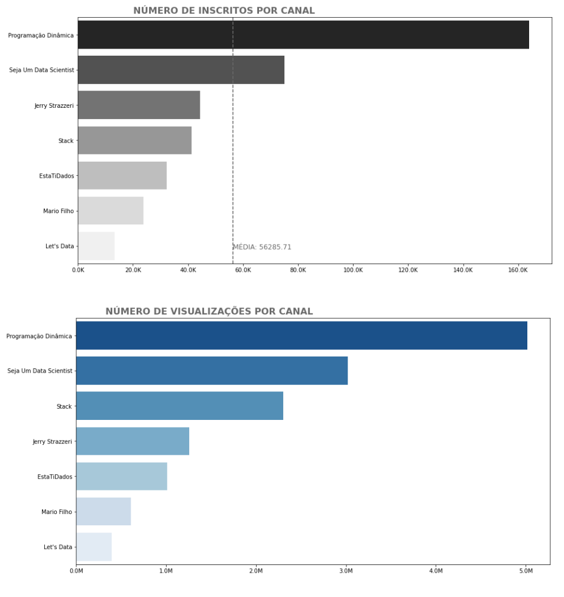
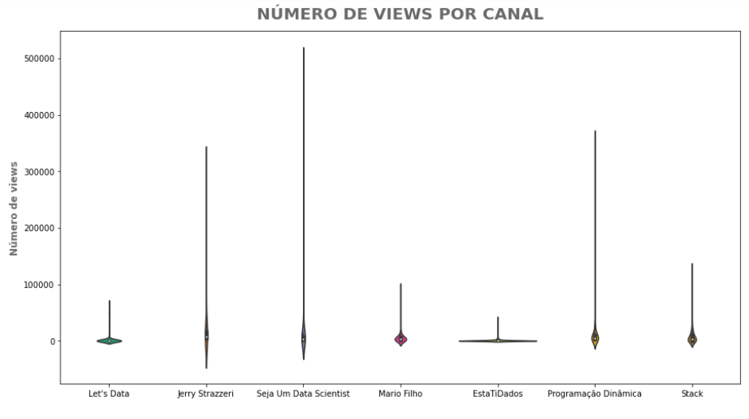
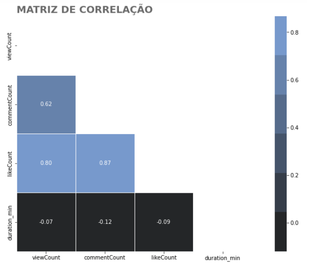
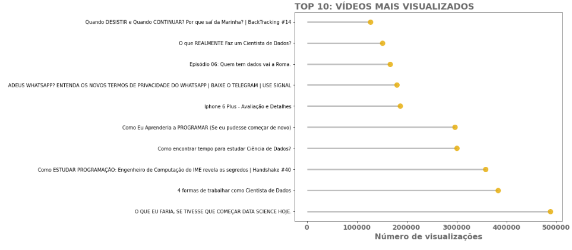
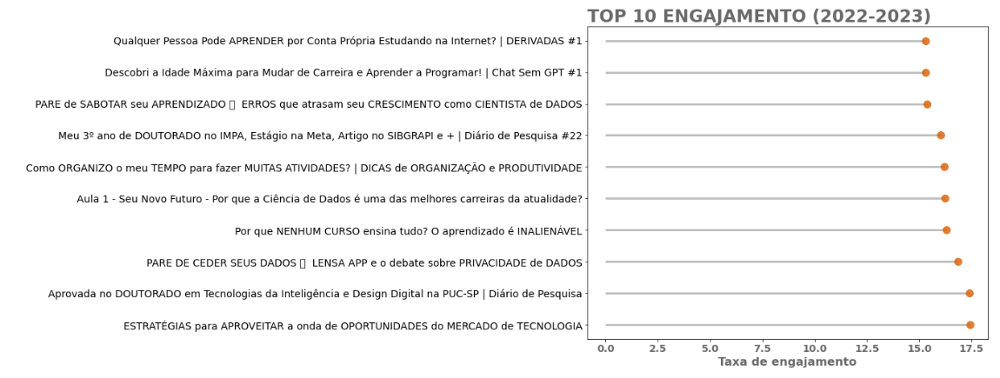
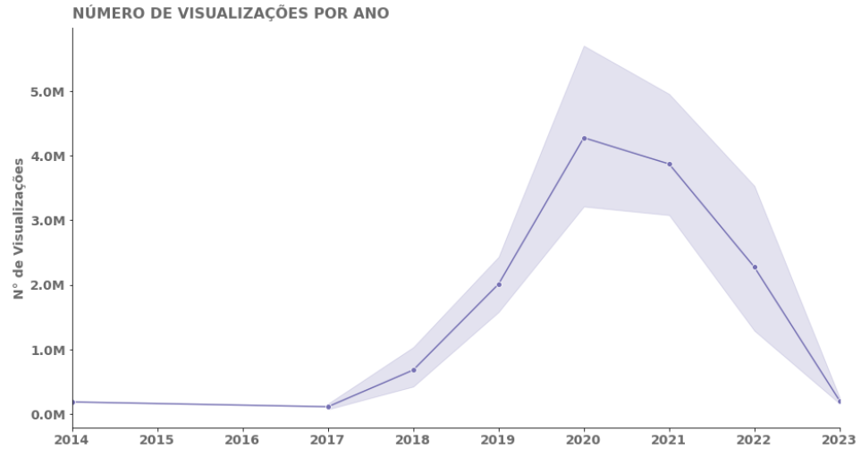
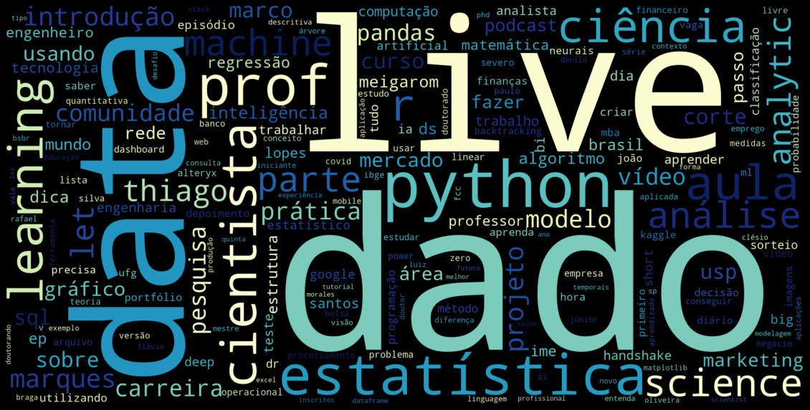
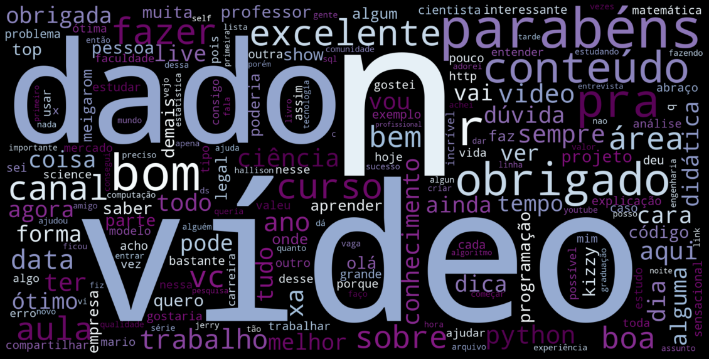

***
# Análise de Dados dos Canais Brasileiros do Youtube sobre Ciência de Dados
***

A Ciência de Dados é uma das áreas de tecnologia que mais crescem atualmente. Com isso em mente, uma empresa de educação tecnológica (edtech) está avaliando a criação de um canal no YouTube para divulgar seu novo curso, "Ciência de Dados Primeiros Passos". Mas como garantir que o canal seja bem-sucedido e atraia o público certo?

Uma das soluções é a análise de dados. É possível coletar informações dos canais mais populares que falam sobre Ciência de Dados no YouTube e avaliar como eles estão atendendo às necessidades dos espectadores. A partir dessas informações, é possível descobrir quais tópicos relacionados à área de dados são mais populares entre os usuários de canais no YouTube e quais estratégias de conteúdo estão funcionando para esses canais.

Além disso, oferecer conteúdo educacional gratuito sobre Ciência de Dados pode ser uma estratégia freemium para atrair novos clientes e gerar interesse em cursos mais avançados e pagos. Essa estratégia pode ajudar a estabelecer a autoridade do canal na área de Ciência de Dados, aumentando a visibilidade e a confiança do público e, consequentemente, melhorando o engajamento e as oportunidades de monetização.

Mas como colocar essa estratégia em prática? Através da mineração de dados e análise de visualizações, curtidas, comentários, entre outros, é possível identificar padrões e recomendar ações para melhorar a interação do público com o canal. A equipe pode oferecer recomendações à empresa de consultoria de Ciência de Dados sobre como maximizar a popularidade do canal e promover seus serviços no YouTube.

## Conjunto de dados

Os dados utilizados neste projeto foram coletados usando a API do YouTube. As informações coletadas incluem informações sobre os vídeos, como número de visualizações, curtidas, comentários, duração e datas de publicação.

Canais analisados:
- Programação Dinâmica
- Seja um Data Scientist
- Jerry Strazzeri
- Stack
- EstatiDados
- Mario Filho
- Let's Data

# Tecnologias utilizadas

- Python 3.9.5
- Jupyter Notebook
- Pandas
- Matplotlib
- Seaborn

# Quão populares são os canais?

O gráfico de barras compara sete canais distintos de Data Science, representando o número de inscritos em cada um deles. É possível notar que o canal Stack tem mais visualizações do que o canal Jerry Strazzeri, mesmo tendo menos inscritos, o que difere da ordem de classificação por inscritos. No geral, a ordem de classificação por visualizações segue uma ordem semelhante à classificação por inscritos.

#  Como é a distribuição de visualizações por canal?

Pode-se perceber a partir do gráfico que os canais Jerry Strazzeri, Seja um Data Scientist e Programação Dinâmica apresentam uma variação considerável em relação ao número de visualizações, o que sugere a presença de alguns vídeos virais nesses canais. Por outro lado, os canais Lets Data, Estatidados e Mário Filho apresentam menos visualizações de forma geral, mas as visualizações são mais consistentes em relação aos vídeos postados.

# Há uma relação entre os comentários, curtidas, número de visualizações e duração de um vídeo?

No gráfico abaixo, podemos perceber que o número de visualizações está fortemente correlacionado com o número de comentários e curtidas. Nota-se que o número de curtidas sugere uma correlação mais forte do que o número de comentários. Quanto mais pessoas assistem a um vídeo, maiores são as chances do vídeo receber comentários e curtidas. Já a duração do video em minutos apresenta uma correlação negativa fraca com as interações.

# Quais são os tópicos mais abordados nos vídeos de ciência de dados?

Os títulos sugerem que há uma grande preocupação com questões relacionadas à carreira em Data Science, como as habilidades necessárias para se destacar no mercado e as melhores práticas para conseguir um emprego na área. Além disso, há uma forte ênfase no aprendizado e no desenvolvimento pessoal, com muitos vídeos fornecendo dicas e conselhos para aspirantes a profissionais.

Outro tema recorrente é a tecnologia, com muitos vídeos abordando tópicos específicos, como algoritmos de machine learning e programação em Python. Além disso, alguns vídeos abordam temas atuais e relevantes, como a política de privacidade do WhatsApp, mostrando que os criadores de conteúdo estão atentos aos assuntos em destaque na mídia.

Ao identificar os tópicos mais relevantes e atraentes para o público-alvo, é possível criar um conteúdo mais eficaz e engajador, que ajude a atrair novos espectadores para o canal e aumentar as oportunidades de monetização.

# Quais são os vídeos com maior taxa de engajamento?

Assim como nos vídeos mais populares e nos mais assistidos que foram publicados de 2022 a 2023, os títulos dos vídeos de Data Science com maior visualização também apresentam conselhos úteis e práticos para iniciantes e estudantes interessados em seguir carreira na área. Entre os temas abordados estão dicas para estudar programação, estratégias para aproveitar oportunidades no mercado de tecnologia e orientações para se organizar e realizar muitas atividades.

Alguns títulos discutem questões relevantes no campo de Data Science, como a privacidade de dados e os erros que prejudicam o crescimento como cientista de dados. Outros títulos compartilham histórias pessoais inspiradoras, como a aprovação no doutorado e o estágio em empresas renomadas. Essa variedade de assuntos demonstra que há uma grande demanda por conteúdo educativo e informativo na área de Data Science, com pessoas buscando tanto conselhos práticos quanto reflexões mais profundas sobre as questões relacionadas ao campo.

# Houve crescimento das visualizações ao longo dos anos para canais de Data Science?

Nos últimos anos, o mercado de trabalho em Data Science cresceu consideravelmente e isso pode ter levado à dispersão do público em busca de informações em diversas fontes. Como resultado, alguns canais de Data Science podem ter sofrido uma queda no número de visualizações. Mas quais seriam os outros fatores que influenciaram essa mudança?

A constante evolução da área de Data Science pode ter aumentado a demanda por conteúdo atualizado e especializado. A concorrência também pode ter crescido, tornando mais difícil para alguns canais se destacarem e conquistarem um público fiel.

Apesar disso, ainda é possível observar uma demanda por conteúdo de qualidade na área de Data Science. Por isso, é essencial que os canais continuem a oferecer conteúdo útil e atualizado, com foco em temas relevantes para a comunidade de Data Science e com abordagens inovadoras para atrair um público cada vez mais exigente e informado.

Alguns canais podem optar por se especializar em nichos específicos, como a aplicação de Data Science em áreas específicas, como saúde e finanças, por exemplo. Isso pode ajudar a atrair um público mais segmentado e aumentar a fidelização dos espectadores.

A mudança nos hábitos de consumo de conteúdo também pode ter influenciado o declínio nas visualizações. Com o aumento do uso de plataformas como podcasts e até mesmo o Chat GPT, os usuários podem estar buscando novas formas de consumir informações sobre Data Science.

# Quais são as palavras mais comuns nos títulos dos vídeos de ciência de dados?

Analisando a wordcloud dos títulos de vídeos de Data Science, é possível perceber que certas palavras aparecem em tamanho maior do que outras, indicando que foram mais frequentemente mencionadas. As palavras "data", "dado", "python", "estatística" e "cientista" são exemplos de termos que se destacam na nuvem de palavras. Por outro lado, palavras como "algoritmo", "classificação" e "regressão" aparecem em tamanho menor, sugerindo que foram menos frequentes nos títulos analisados. Esses resultados podem ser úteis para identificar os tópicos mais abordados e menos abordados nos vídeos de Data Science e, assim, direcionar a criação de conteúdo para atender às necessidades da audiência.

# O que dizem os espectadores dos vídeos?

Realizando uma análise dos comentários, é possível notar que palavras de agradecimento, como "parabéns", "obrigado" e "excelente", são bastante recorrentes. Além disso, as palavras "dado" e "vídeo" também aparecem com frequência, sugerindo que os espectadores estão interessados em discutir o conteúdo apresentado e em compartilhar suas opiniões sobre o vídeo. Essas informações podem ser úteis para entender o engajamento do público e o impacto dos vídeos na comunidade de ciência de dados.

# CONCLUSÕES

Ao longo deste projeto, exploramos maneiras de garantir que um canal no YouTube dedicado a Ciência de Dados seja bem-sucedido e atraia o público certo. A partir da análise de dados dos canais mais populares sobre o assunto, identificamos que oferecer conteúdo educacional gratuito é uma estratégia freemium que pode atrair novos clientes e estabelecer a autoridade do canal na área de Ciência de Dados.

Ao examinarmos os dados de vídeo de sete dos canais mais populares no YouTube relacionados a dados, descobrimos algumas informações valiosas para aqueles que desejam começar um canal nessa área. Identificamos que vídeos com mais visualizações têm maior probabilidade de receber interações, e que vídeos muito longos tendem a receber menos visualizações e interações. Também constatamos que comentários deixados pelos espectadores em geral foram positivos, indicando a satisfação do público com o conteúdo produzido pelos canais analisados.

Com base nessas informações, sugerimos que novos criadores de conteúdo em Ciência de Dados explorem várias possibilidades, desde questões teóricas até dicas práticas e histórias inspiradoras. É interessante produzir conteúdo mais prático, como tutoriais passo a passo para iniciantes e aulas sobre ferramentas e linguagens de programação específicas, como Python e R. Também é útil compartilhar histórias inspiradoras de profissionais em Ciência de Dados, incluindo suas trajetórias profissionais e desafios enfrentados ao longo do caminho.

## Limitações

Embora o conjunto de dados seja apropriado para a análise, a escolha dos canais pode não ser representativa de todos os canais de ciência de dados em língua portuguesa no Youtube. Além disso, há inúmeros canais menores que podem ser interessantes de investigar e que podem ser considerados em futuros projetos.

## Referências:

- Disponível em: https://www.datacamp.com/tutorial/wordcloud-python. Acesso em: 9 may. 2023.

- API Guide — youtube-data-api 0.0.17 documentation. Disponível em: https://youtube-data-api.readthedocs.io/en/latest/youtube_api.html. Acesso em: 9 may. 2023.

- ANALYTICS, T. V. D. Youtube API for python: How to create a unique data portfolio project. Disponível em: https://www.youtube.com/watch?v=D56_Cx36oGY. Acesso em: 9 may. 2023.